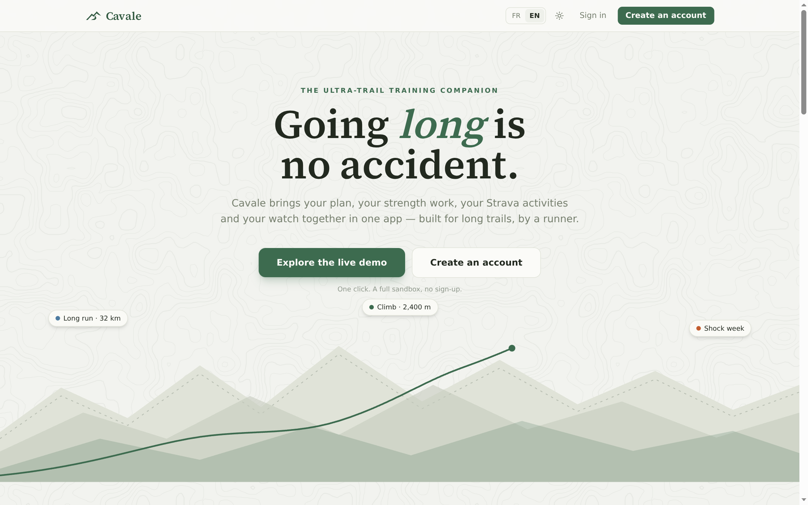
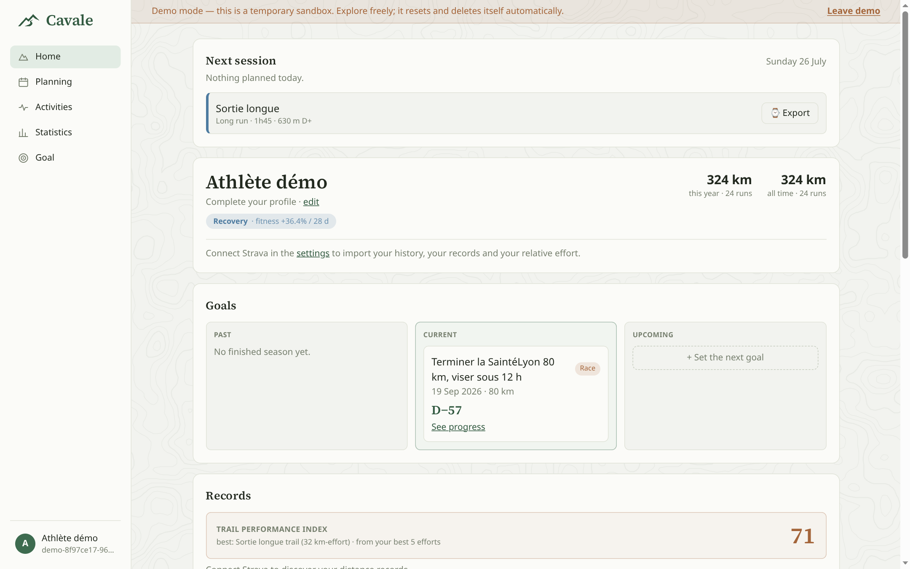
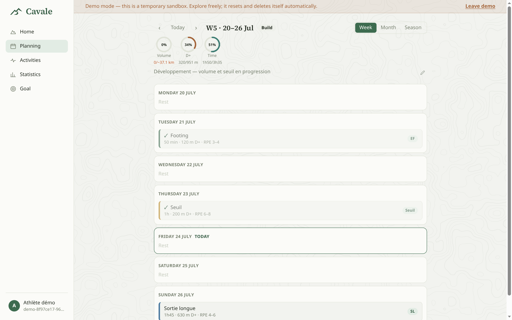
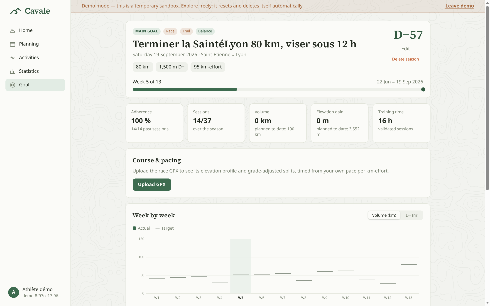
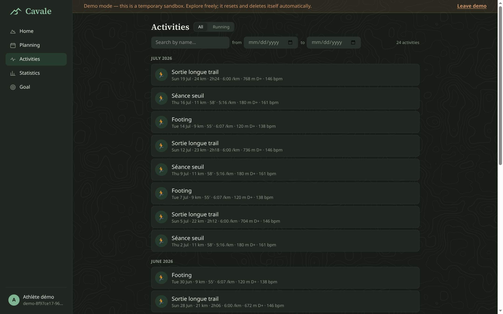
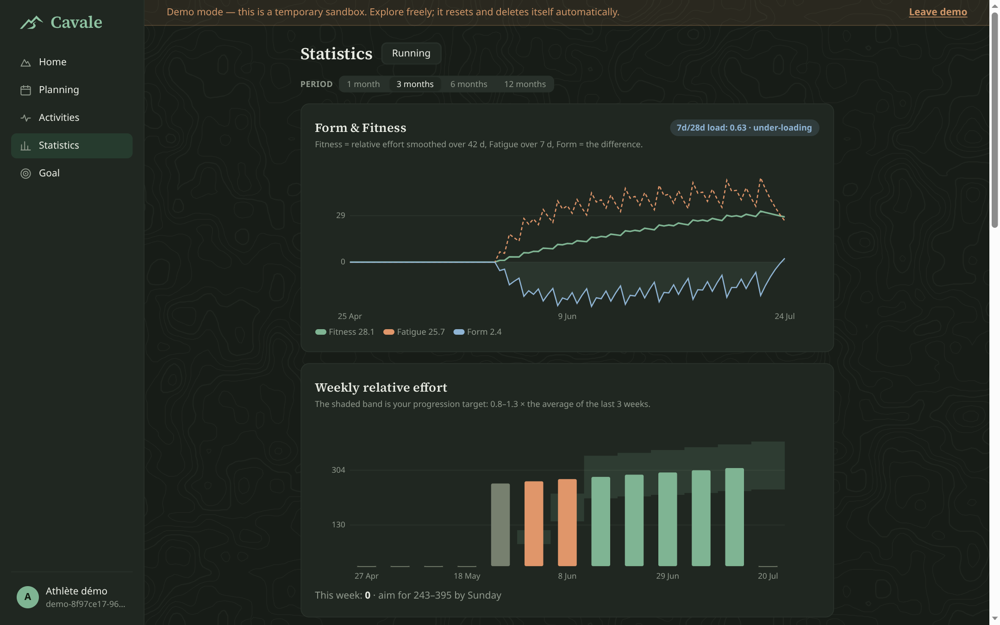
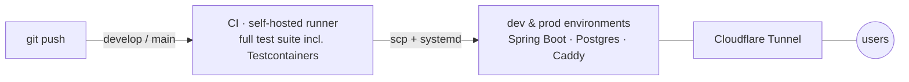

# Cavale

> **cavale** /ka.val/ — French noun: a getaway, a free run, a great escape.

The **ultra-trail training companion**: one app for the plan, the strength work, the
Strava data and the watch. Built end-to-end — Spring Boot API, React SPA, Postgres,
CI/CD on self-hosted runners — and shipping a **built-in MCP server**, so an AI
assistant can coach directly on top of your training data.

**Live at [cavale.adel-sol.com](https://cavale.adel-sol.com)** — hit *Explore the
live demo*: one click provisions a private, fully-seeded, throwaway sandbox.
No sign-up, it deletes itself.



## A quick tour

| Home — next session, goals, records | Planning — typed, colour-coded weeks |
|---|---|
|  |  |

| Goal — the season converges on the A race | Activities — synced or logged, shoes tracked |
|---|---|
|  |  |



## What it does

- **Season-long plans** — weeks are typed (build / shock / deload / taper / race),
  sessions are colour-coded by kind; week, month and season views.
- **Strava, live** — webhook push with a polling safety net: activities land seconds
  after you save them.
- **Strength included** — circuits, live in-workout logging, exercise sheets; the
  gym is part of the plan, not another app.
- **Down to the watch** — planned workouts push to Garmin via Intervals.icu, target
  paces on the wrist.
- **Stats that decide** — fitness/fatigue/form, ACWR-guarded progression, a trail
  performance index, shoe mileage.
- **An AI coach that speaks MCP** — the API embeds a stateless MCP server
  (JSON-RPC over `/mcp`, same JWT auth as REST). Plug in Claude and build, validate
  and re-align plans conversationally, inside hard physiological guardrails.
- **Bilingual (FR/EN), light & dark, mobile-first.**

## Repository map

This is the **meta-repository**: it owns no application code, it pins each part at
a specific commit via git submodules.

| Part | Path   | Repository | Stack |
|------|--------|------------|-------|
| API  | `api/` | [`cavale-api`](https://github.com/MauriceNDS/cavale-api) | Java 26 · Spring Boot 4 · Postgres 18 · Flyway · MCP |
| Web  | `web/` | [`cavale-web`](https://github.com/MauriceNDS/cavale-web) | React 19 · TypeScript · Vite · Tailwind 4 · TanStack |

## How it runs



- `git push` on `develop` deploys to the dev environment, on `main` to production —
  a red test suite blocks the deploy.
- Everything is self-hosted on a Proxmox homelab (LXC containers), published
  outbound-only through a Cloudflare Tunnel: no open ports.
- The public demo runs on the exact production stack shown above.

## Cloning

```bash
git clone --recursive https://github.com/MauriceNDS/cavale.git
```

Already cloned without `--recursive`?

```bash
git submodule update --init --recursive
```

### The two-step submodule workflow

Submodules are pointers to a commit in another repo. The golden rule:

> **Commit & push inside the part first. THEN bump the pointer in the meta repo.**

```bash
cd api
git add -A && git commit -m "feat(training): add plan endpoint"
git push                     # push the PART first — non-negotiable

cd ..
git add api                  # stages the updated submodule commit
git commit -m "chore: bump api"
git push                     # push the META
```

## Status & contributions

In production and actively developed. The code is public **to read** — it doubles
as an engineering portfolio — but this is a personal project: issues and questions
are welcome, pull requests are generally not merged.
